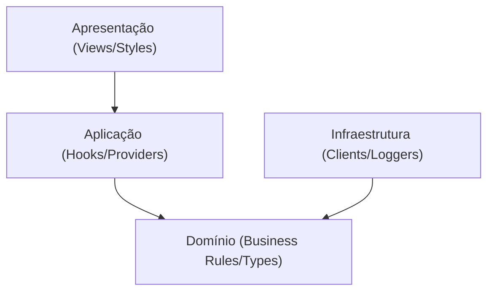

# Módulo 3: Arquitetura

Este documento apresenta a estrutura de arquitetura de software, a direção de dependências e os padrões de design adotados no projeto **AmaranthosWeb**.

---

## 1. Visão Geral da Arquitetura

O sistema é construído utilizando o padrão **Feature-First** (Funcionalidades em Primeiro Lugar), otimizado para o sistema de rotas físicas do Next.js App Router. Os módulos do sistema são organizados por contexto de domínio, isolando a lógica de negócio dos componentes puramente visuais.

A estrutura de arquivos do código-fonte ([src/](file:///c:/Design/Projetos/Gisele/AmaranthosWeb/src/)) divide-se em quatro camadas lógicas fundamentais, onde a direção da dependência é estritamente de fora para dentro:

---

## 2. Detalhamento das Camadas do Sistema

### 1. Camada de Apresentação (UI)

- **Localização**:
  - [src/app/](file:///c:/Design/Projetos/Gisele/AmaranthosWeb/src/app/): Define o roteamento, layouts gerais e metadados.
  - [src/sections/](file:///c:/Design/Projetos/Gisele/AmaranthosWeb/src/sections/): Cenários ou seções complexas de páginas (Hero, Catalogo, Sobre, Contato).
  - [src/components/](file:///c:/Design/Projetos/Gisele/AmaranthosWeb/src/components/): Peças de interface reutilizáveis (botões, contêineres, cabeçalho e rodapé).
  - [src/styles/](file:///c:/Design/Projetos/Gisele/AmaranthosWeb/src/styles/): Definições de tipografia corporativa e folha de estilos global.
- **Regra**: Esta camada conhece os hooks e as estruturas de tipo de domínio, mas nunca executa cálculos matemáticos de precificação ou altera dados de catálogo diretamente.

### 2. Camada de Aplicação (App Services)

- **Localização**:
  - [src/hooks/](file:///c:/Design/Projetos/Gisele/AmaranthosWeb/src/hooks/): Gerenciadores de estado local e integrações de renderização.
  - [src/lib/lenis.ts](file:///c:/Design/Projetos/Gisele/AmaranthosWeb/src/lib/lenis.ts): Configuração e controle do motor de rolagem suave.
  - [src/lib/gsap.ts](file:///c:/Design/Projetos/Gisele/AmaranthosWeb/src/lib/gsap.ts): Controle global de registro e inicialização de plugins GSAP.
- **Regra**: Responsável por gerenciar os ciclos de vida de efeitos colaterais visuais e o estado global da aplicação (como a sacola de compras virtual).

### 3. Camada de Domínio (Business Core)

- **Localização**:
  - [src/lib/types.ts](file:///c:/Design/Projetos/Gisele/AmaranthosWeb/src/lib/types.ts): Definição de tipos e interfaces canônicas do sistema.
  - [src/lib/pricing.ts](file:///c:/Design/Projetos/Gisele/AmaranthosWeb/src/lib/pricing.ts): Motor de cálculo de custos, adicionais, markups e impostos.
  - [src/data/](file:///c:/Design/Projetos/Gisele/AmaranthosWeb/src/data/): Banco de dados em memória contendo as flores, buquês e configurações.
- **Regra**: É o coração do negócio. Esta camada é 100% isolada e independente de frameworks. Não importa componentes do React, utilitários do Next.js ou bibliotecas do Tailwind CSS.

### 4. Camada de Infraestrutura (Adapters)

- **Localização**:
  - [src/lib/errors.ts](file:///c:/Design/Projetos/Gisele/AmaranthosWeb/src/lib/errors.ts): Logger de falhas e barreira protetora contra travamentos na renderização (Error Boundary).
- **Regra**: Fornece recursos técnicos externos para o sistema, garantindo a estabilidade e a resiliência operacional da aplicação.

---

## 3. Padrões de Design Adotados

### 1. Compound Components (Componentes Compostos)

- Aplicado no Configurador de Buquês. Permite declarar componentes complexos compartilhando um estado comum de forma implícita (exemplo: `<Configurador><Configurador.Visual /><Configurador.Painel /></Configurador>`). Evita o repasse excessivo de propriedades (prop drilling).

### 2. Provider Pattern (Provedores Globais)

- Usado para garantir que serviços como Lenis (rolagem suave) e GSAP estejam disponíveis para todos os elementos filhos sem reinicializações duplicadas do motor no carregamento de novas rotas.

### 3. Design Tokens via CSS Custom Properties

- Os tokens visuais de marca (cores institucionais e fontes corporativas) são declarados como propriedades CSS customizadas nativas no arquivo [globals.css](file:///c:/Design/Projetos/Gisele/AmaranthosWeb/src/app/globals.css) e injetados de forma estendida no compilador do Tailwind CSS v4 através da diretiva `@theme`.

### 4. Barrel Exports

- Arquivos `index.ts` são mantidos nas pastas de componentes para expor apenas as interfaces públicas necessárias, simplificando os caminhos de importação do Next.js.
