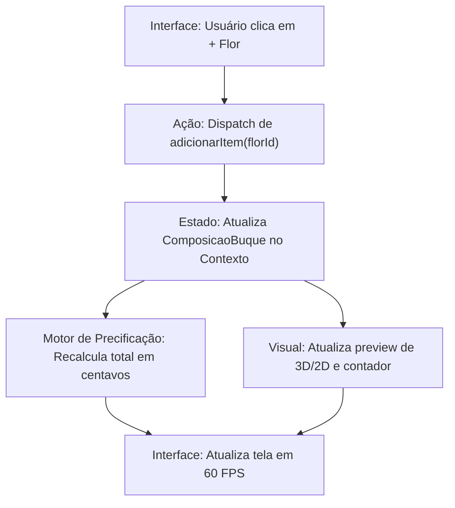

# Módulo 4: Design Detalhado

Este documento detalha o modelo de dados canônico, a lógica matemática do Motor de Precificação e o ciclo de vida de dados do Configurador de Buquês do projeto **AmaranthosWeb**.

---

## 1. Modelo de Dados (Camada de Domínio)

As interfaces de tipo estão centralizadas em [src/lib/types.ts](file:///c:/Design/Projetos/Gisele/AmaranthosWeb/src/lib/types.ts). Todos os valores monetários são representados como números inteiros de 32 bits representando centavos (exemplo: R$ 150,00 é processado como `15000`).

### Tipos de Entidades

- **`Flor`**: Haste de flor avulsa moldada em chenille.
  - `id`: string única
  - `nome`: string
  - `precoCusto`: número inteiro (centavos)
  - `precoVenda`: número inteiro (centavos)
  - `tempoPreparoMinutos`: número inteiro
  - `imagemUrl`: string
  - `categoria`: 'flor' | 'folhagem'
- **`Buque`**: Produto pronto de buquê montado pelo ateliê.
  - `id`: string única
  - `nome`: string
  - `descricao`: string
  - `precoCusto`: número inteiro (centavos)
  - `precoVenda`: número inteiro (centavos)
  - `tempoPreparoMinutos`: número inteiro
  - `imagemUrl`: string
  - `composicao`: lista de IDs e quantidades de flores
- **`ComposicaoBuque`**: Estado dinâmico do buquê personalizado no configurador.
  - `itens`: lista de `{ florId: string, quantidade: number }`
  - `embalagemId`: string (Kraft, Tecido, Juta, ou sem embalagem)
  - `fitaId`: string (Cetim, Juta, Algodão, ou sem fita)
  - `mensagemCartao`: string (opcional)

---

## 2. O Motor de Precificação (`pricing.ts`)

A lógica de cálculo do preço de venda de um item personalizado ou produto padrão é regida pela fórmula canônica baseada em custos reais de materiais, mão de obra e aplicação de markup multiplier (multiplicador de margem).

A fórmula para o cálculo do preço de venda é:

\[Preço = (CustoMaterial + CustoTempo + CustoExtras) \times Markup\]

Onde:

- **`CustoMaterial`**: Soma do preço de custo de cada haste de flor ou acessório utilizado.
- **`CustoTempo`**: Calculado multiplicando o tempo total de produção em minutos pelo custo da hora produtiva da artesã.
  - A constante de custo de hora configurada é: R$ 15,00 por hora (definido como `1500` centavos).
  - O cálculo do custo do minuto é: \(\frac{1500}{60} = 25\) centavos por minuto.
- **`CustoExtras`**: Custos adicionais de fitas, embalagens e tags decorativas.
- **`Markup`**: Multiplicador padrão de conversão comercial de margem do ateliê (definido como `2.2` no arquivo de precificação oficial).

### Exemplo de Cálculo Prático (em centavos):

Haste de Flor com custo de material de R$ 3,00 e tempo de preparo de 30 minutos:

1. \(CustoMaterial = 300\) centavos.
2. \(CustoTempo = 30 \times 25 = 750\) centavos.
3. \(SomaCustos = 300 + 750 = 1050\) centavos (R$ 10,50).
4. \(PreçoVenda = 1050 \times 2.2 = 2310\) centavos (R$ 23,10).

O motor de precificação realiza automaticamente o arredondamento matemático para valores inteiros e retorna o resultado formatado em centavos para a camada de apresentação.

---

## 3. Ciclo de Vida do Configurador Virtual

O fluxo de dados da personalização do buquê segue um ciclo reativo gerenciado pelo React State:

### Detalhamento do Fluxo:

1. **Inicialização**: O configurador carrega um estado de `ComposicaoBuque` vazio ou com uma receita padrão pré-selecionada.
2. **Mutação**: Conforme o usuário manipula botões de incremento de flores ou altera o tipo de fita/embalagem, funções puras geram um novo estado imutável.
3. **Avaliação**: O novo estado é repassado ao módulo [pricing.ts](file:///c:/Design/Projetos/Gisele/AmaranthosWeb/src/lib/pricing.ts), que recalcula o preço dinamicamente a cada renderização.
4. **Fechamento**: Ao clicar em "Concluir Pedido", o estado completo do buquê é serializado em uma string codificada de URL e empacotado para despacho via link externo de WhatsApp.
